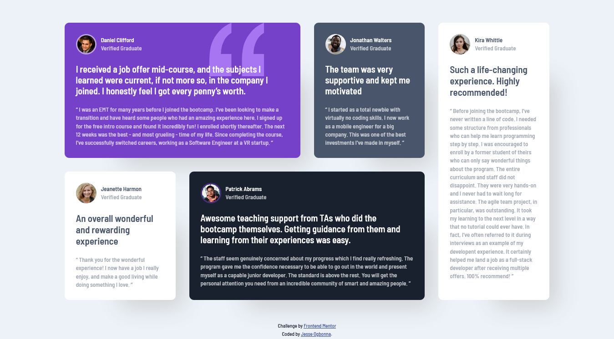

# Frontend Mentor - Testimonials grid section solution

This is a solution to the [Testimonials grid section challenge on Frontend Mentor](https://www.frontendmentor.io/challenges/testimonials-grid-section-Nnw6J7Un7). Frontend Mentor challenges help you improve your coding skills by building realistic projects. 

## Table of contents

- [Overview](#overview)
  - [The challenge](#the-challenge)
  - [Screenshot](#screenshot)
  - [Links](#links)
- [My process](#my-process)
  - [Built with](#built-with)
  - [What I learned](#what-i-learned)
  - [Continued development](#continued-development)
  - [Useful resources](#useful-resources)
- [Author](#author)
- [Acknowledgments](#acknowledgments)

## Overview

### The challenge

Users should be able to:

- View the optimal layout for the site depending on their device's screen size

### Screenshot

### Links

- Solution URL: [Add solution URL here](https://your-solution-url.com)
- Live Site URL: [Add live site URL here](https://your-live-site-url.com)

## My process

### Built with

- Semantic HTML5 markup
- CSS custom properties
- Flexbox
- CSS Grid

### What I learned

I have been using grid for a while now but i usually arrange the grid boxes manually. However, while working on this challenge, i learnt how to use grid template areas to arrange items using css grids. My code was much neater and shorter and easy to manipulate too.

### Continued development

CSS is tricky and i come across new things everyday. My aim is contiuned to learn and understand css. I still think there's more to grid than i know now. 

### Useful resources

- Kevin Powell's Grid video [https://www.youtube.com/watch?v=rg7Fvvl3taU&t=1816s]

## Author

- Website - [Jesse Ogbonna](https://jesseolisa.github.io/my-portfolio/)
- Frontend Mentor - [@jesseOGBO](https://www.frontendmentor.io/profile/JesseOlisa)
- Twitter - [@jesseOGBO](https://www.twitter.com/jesseOGBO)

## Acknowledgments

Kevin Powell's CSS grid youtube video really helped me complete this challenge. 
